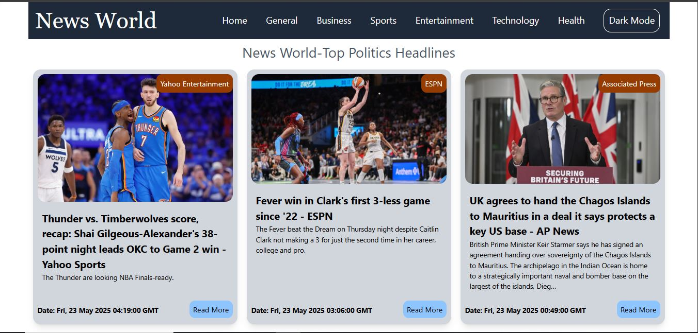

# News World- Newspaper App
A full features of Newspaper App, and responsive UI using TailwindCSS.

#features
- API Call Newspaper App
- Responsive UI/UX
- User Friendly UI/UX
- Page Pagination use.
- Use Context for low API hit Model.
- Before paged saved if new page need then only API Hit.
- Smooth Bar loader effect.
- Full Resposive for (Mobile, Tablet, Laptop, Desktop).
- Used React Nested Routing system.
- Dark Mode Available.
- On page Nav Bar.


## 🛠 Tech Stack

- React + Vite
- Tailwind CSS
- NewsAPI

## ScreenShoot



## Live Demo
Not Available.

## Personal Note
Git commit history is not available for this project because it was developed on a low-end system.
Running Git or Git Extensions in VS Code significantly slowed down the editor, often causing it to hang.
As a result, version control was managed manually outside of VS Code for this project.


## 🚀 Run Locally

Clone the project:

```bash
git clone https://github.com/tousher101/News-World.git
cd News-World
npm install
npm run dev


